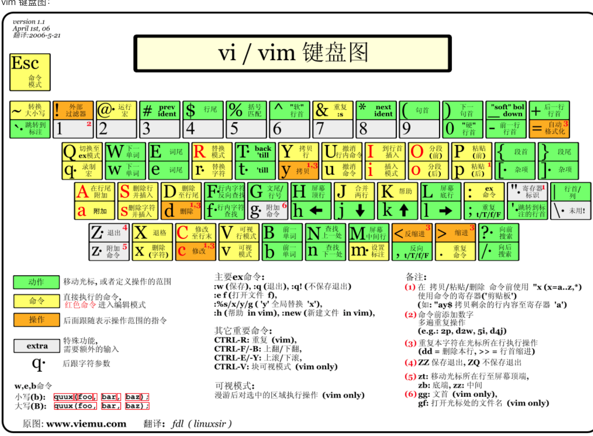
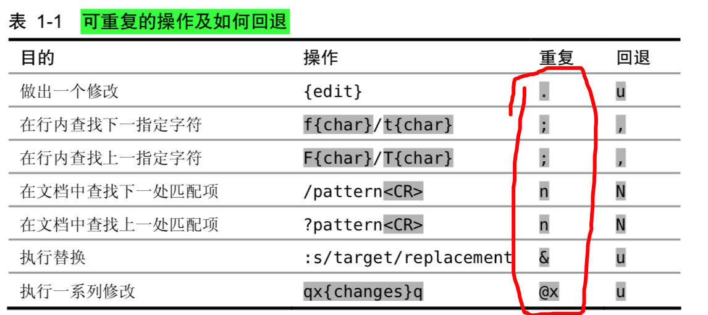

#### 常用键盘

#### 命令模式(普通)
- 组合快捷键
> **>G** 当前行到文件末尾缩进。

- 常用进入输入模式命令
> **a** 在光标后添加内容 A 在当前行尾添加内容。
> 
> **s** 删除光标选中字符 并插入模式 S 删除当前行 并插入模式。
> 
> /* 搜索当前光标选中的下一个字符。
> 
> **daw** 删除一个单词。**dap** 删除一段落。
> **d2w/2dw** 删除两个单词。
> **dw.** 删除一个单词，然后 按.重复删除单词操作。
> **dw/db** 向前或向后删一个单词。
> 
> **C+a/C+x** 分别对数字执行++和--,它会自动在当前行找到第一个数字。(对于007这种加1，会把它当成八进制执行，如果想让遇到数字按着10进制执行，可以设置 set nrformats=)。
> 
> 
> 

#### 输入模式(插入)

#### 底线命令模式(输入 :)
- 替换命令
> %s/搜索字符/代替字符/g 全部替换，省略%时代表当前行替换。
> 
> :n,$s/vivian/sky/g 替换第 n 行开始到最后一行中每一行所有 vivian 为 sky
> 
> :s#vivian/#sky/# 替换当前行第一个 vivian/ 为 sky/( # 作为分隔符，此时中间出现的 / 不会作为分隔符)
> g 表示全局替换 c 表示进行确认 p 表示替代结果逐行显示（Ctrl + L恢复屏幕）

#### 技巧

